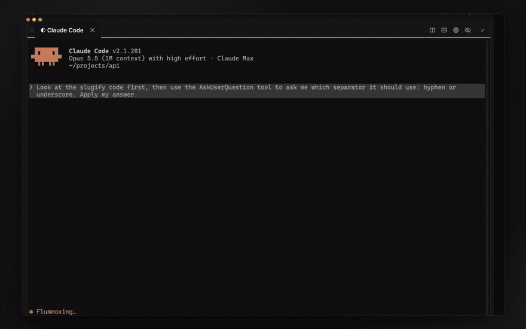
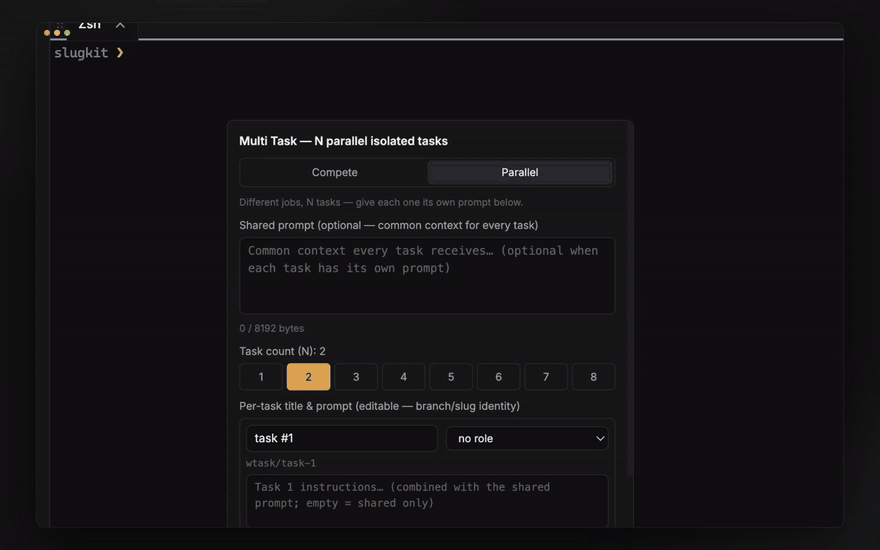
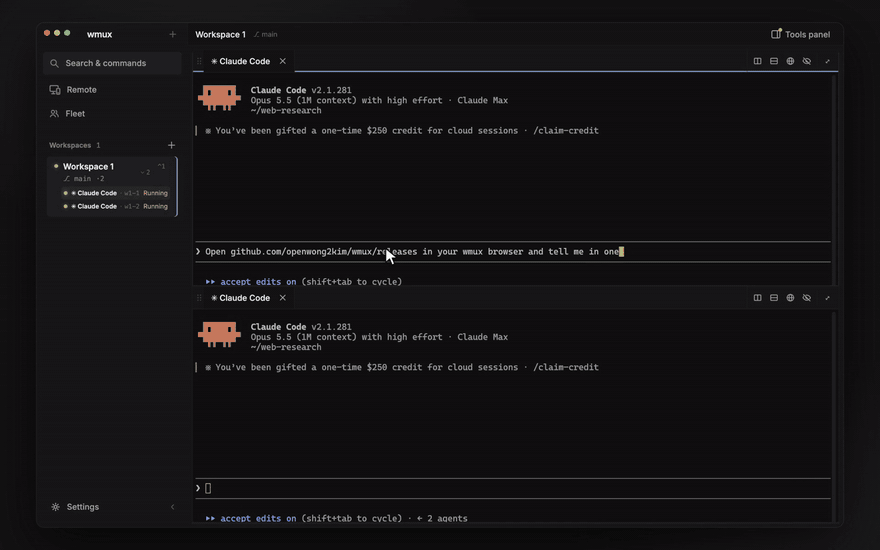
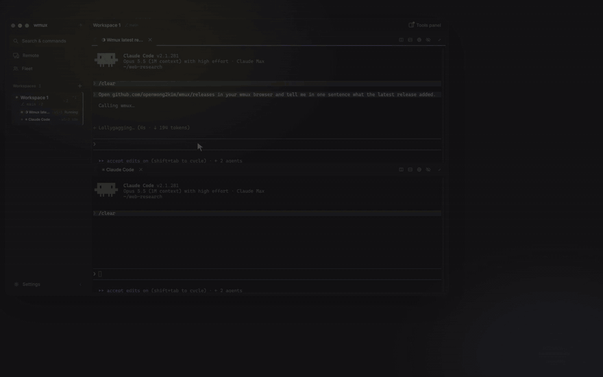
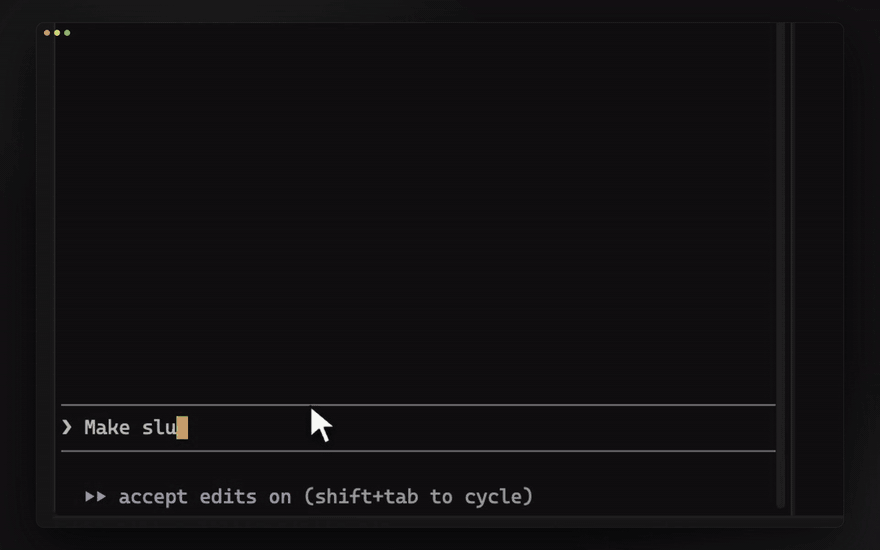
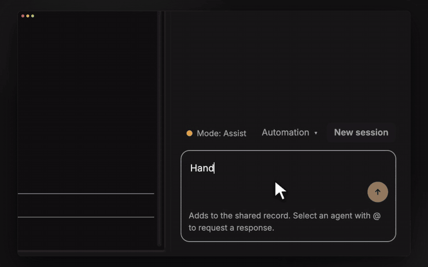
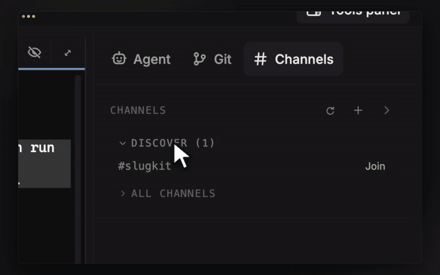
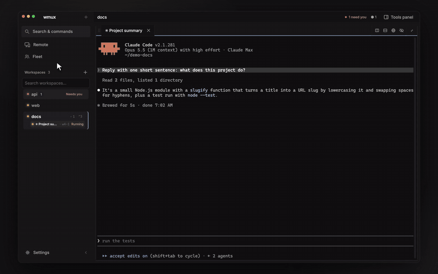
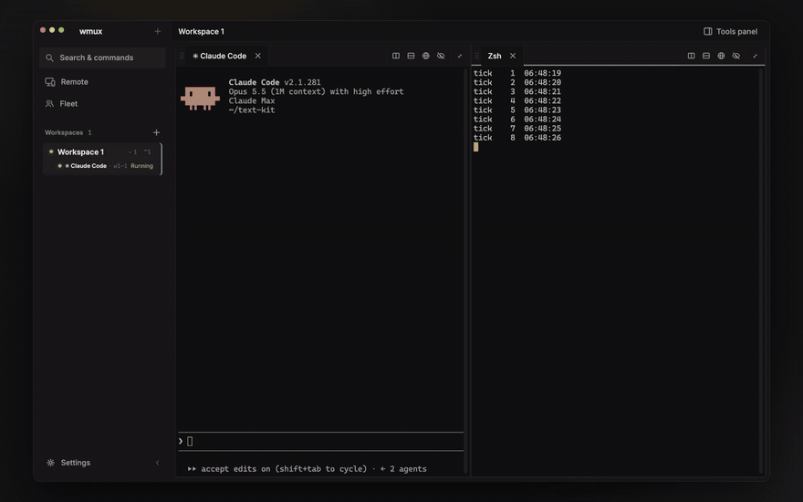

<div align="center">

# wmux

### The workspace for AI agents.

Run Claude Code, Codex, Gemini, or any CLI agent side by side — native on **Windows and macOS** — and answer them from your **iPhone**.

[](https://github.com/openwong2kim/wmux/releases/latest)
[](https://github.com/openwong2kim/wmux/releases/latest)
[](https://apps.apple.com/app/wmux-workspace-for-ai-agents/id6797904556)
[](https://github.com/openwong2kim/wmux/releases/latest)
[](https://github.com/openwong2kim/wmux/releases)
[](LICENSE)

[**Download**](https://github.com/openwong2kim/wmux/releases/latest) · [**Website**](https://www.wmux.app) · [**Docs**](docs/README.md) · [**iOS app**](https://apps.apple.com/app/wmux-workspace-for-ai-agents/id6797904556)

<a href="https://www.wmux.app"></a>

<sub>One prompt, three agents in three git worktrees — and the one question that came up, answered from a phone.</sub>

</div>

> **What's a *workspace multiplexer*?** tmux splits a terminal. wmux multiplexes whole **workspaces** — terminals, agents, git worktrees, a browser, and the channels they coordinate over — all owned by a daemon that keeps them running across quits, crashes, and full reboots.

## Install

**Windows** — a package manager skips the SmartScreen prompt:

```powershell
winget install openwong2kim.wmux    # or: choco install wmux
```

<sub>Offline? [Download Setup.exe](https://github.com/openwong2kim/wmux/releases/latest). It is signed with a SignPath *test* certificate for now, so SmartScreen shows an unknown publisher ([why?](#install-help)).</sub>

**macOS** (Apple Silicon) — [download the .dmg](https://github.com/openwong2kim/wmux/releases/latest) and drag wmux to Applications. It is Developer ID signed and notarized; on first launch the `wmux` CLI installs itself onto your PATH.

**iPhone** — [wmux for iOS on the App Store](https://apps.apple.com/app/wmux-workspace-for-ai-agents/id6797904556) (free). It pairs with the daemon on your Mac: start `wmux web` over HTTPS (the sidebar **Remote** button has a one-click Tailscale option) and scan the QR code it shows.

**Linux** — experimental AppImage / .deb / .rpm builds are on the [releases page](https://github.com/openwong2kim/wmux/releases/latest).

<sub>Windows x64 and macOS arm64 update themselves: wmux checks for a release every 30 minutes and verifies it against a published SHA-256 before installing.</sub>

## Features

### Answer your agents from your phone

When an agent stops to ask you something — a Claude Code `AskUserQuestion` prompt, or a tool call held by a wmux approval gate — the question lands on your iPhone's lock screen as a push notification. Pick the answer in the Inbox (an option, **Approve**, or **Deny**) and the pane on your desktop advances. Terminals and agent output go straight from your Mac to your phone, against the daemon you run; notification content reaches the push relay only as a sealed envelope it cannot read. The one exception is the lock-screen Live Activity: it carries six plain counts (pending approvals, running / working / idle agents, blocked panes, longest wait), and when it starts, your Mac's hostname — no pane names or question text. See [the phone client contract](docs/phone-client-contract.md).



### One prompt, N worktrees

Fan one prompt out into up to 8 tasks, each in its own git worktree on a fresh `wtask/*` branch, with its own agent pane and a private mission channel. Review the diffs side by side, tick the hunks you want across files, and adopt them as one all-or-nothing `git apply` — your tree takes the whole selection or stays untouched. Then close the task or open a pull request in one click.



### Two ways to browse

Your agents drive the browser through wmux's MCP tools — navigate, click, type, snapshot, screenshot, stateful `browser_repl` sessions, and `browser_replay` for recorded flows — and you watch every page they touch. Both backends below get the full automation toolset; pick one in Settings → Browser. (A third, *External*, only opens and navigates tabs in your default browser.)

**Built-in browser panes.** An embedded browser pane opens as a split in the agent's workspace, and each agent gets its own — no agent drives another agent's pane.



**A real Chrome over CDP.** Choose *Chrome (dedicated agent browser)* and your agents drive a real Chrome over CDP instead, each in its own tab. It keeps its own persistent profile — sign in once and the logins stick — separate from your daily browser, and each workspace can bind its own Chrome profile.



### Claude Code and Codex, talking

Agents in different panes message each other through wmux, whichever CLI they run. Here Claude Code changes a function and asks the Codex pane next to it for a review with `send_message`; Codex reads the file and sends its review back the same way, and Claude adds the test Codex suggested. A busy agent gets a one-line notice naming the sender and reads the full message with `a2a_task_query`.



### Agents that coordinate

An orchestrator hands a task to an idle pane and relays the answer back. An execute approval gate stops any agent from running code in your workspace without your OK.



Channels are durable rooms your agents read, post, and get @-mentioned into, each message with a server-verified sender.



### Fleet View

`Cmd+Shift+A` (`Ctrl+Shift+A` on Windows and Linux) shows every agent across every workspace in one panel, blocked ones first, with one inbox for every pending approval. From a local agent's row you can jump to its pane, message it, stash it, label it, or close it; remote rows jump.



### Survives quit, crash, and reboot

A standalone daemon owns every PTY, so closing the app leaves your sessions running — processes and all.



After a crash or a full OS reboot, a recovered pane offers **Resume**. Click it to type the agent command back in; for Claude Code, a second click adds the exact session's `--resume <id>` when wmux knows which session the pane held (otherwise it falls back to the most recent one). Press Enter and you are back in the conversation. Panes declared in `wmux.json` are supervised and restarted automatically.


## More

- **78 MCP tools, zero config** — browser, terminal, panes, channels, A2A, fan-out, and orchestrator tools register themselves in three load-out profiles (`full`, `core`, `commander`); or script the `wmux` CLI (`send`, `read-screen`, `list-panes`, `channel post`).
- **Prompt schedules** — queue an exact prompt for one agent session (**+1h / +5h / +24h**, one-shot or repeating); it waits for the session to be idle before it delivers ([details](docs/how-to/session-prompt-scheduling.md)).
- **One-click loops** — put the orchestrator on an objective with per-iteration steps and a done-when checklist; it keeps working across restarts.
- **`wmux web`** — your live panes in any phone browser (PWA-installable), read-only and loopback-only by default.
- **Notifications** — desktop toasts when an agent finishes, flags on `rm -rf` / `git push --force` / `DROP TABLE`, and optional webhook or ntfy pings from the daemon.
- **Themes & locales** — 9 built-in UI themes plus a custom theme, 11 terminal palettes (light ones included), and 23 locales scaffolded (English, Polish, Chinese, and Korean are the most complete) — [translations welcome](https://github.com/openwong2kim/wmux/labels/good%20first%20issue).
- **Plugins** — sandboxed iframe plugins with an explicit permission model.
- **Security** — token-authed IPC, SSRF guard, PTY input sanitization, randomized CDP port, Electron Fuses.

<details>
<summary><b>Keyboard shortcuts</b></summary>

| Key | Action | Key | Action |
|-----|--------|-----|--------|
| `Ctrl+D` | Split right | `Ctrl+Shift+D` | Split down |
| `Ctrl+T` / `Ctrl+W` | New / close tab | `Ctrl+N` | New workspace |
| `Ctrl+1~9` | Switch workspace | `Ctrl+click` | Add to multiview |
| `Ctrl+Shift+A` | Fleet View | `Ctrl+Shift+L` | Open browser |
| `Ctrl+B` → key | Prefix mode | `` Ctrl+` `` | Floating pane |
| `Ctrl+K` | Command palette | `Ctrl+I` | Notifications |
| `Ctrl+F` | Search (regex) | `Ctrl+M` | Scroll bookmark |
| `Ctrl+Shift+X` | Vi copy mode | `Ctrl+,` | Settings |
| Right-click | Smart copy / paste / link menu | `F12` | Browser DevTools |

<sub>On **macOS**, app shortcuts live on `⌘` instead of `Ctrl`, so `Ctrl+C`, `Ctrl+D`, and friends pass through to the shell.</sub>

</details>

<details>
<summary><b>Full feature list</b></summary>

- **Terminal** — xterm.js + WebGL, native PTY (ConPTY on Windows, forkpty on macOS), Unicode 11 width tables (correct CJK / emoji), split panes, tabs, floating pane, smart right-click (selection→copy / empty→paste / link menu), scroll bookmarks, Vi copy mode, regex search, configurable scrollback (up to 100K lines) with disk persistence, shell integration (OSC 133) for semantic command boundaries (Constrained Language Mode safe).
- **Keybindings** — `Ctrl+B` prefix mode with a default action set, fully customizable, reset-to-defaults.
- **Workspaces** — drag-and-drop sidebar, `Ctrl+1~9` quick switch, multiview (several workspaces side by side), layout templates, full session persistence (layout / tabs / cwd / scrollback), Fleet View cockpit.
- **Git surface** — a Git tab in the dock for the repo behind your active pane: worktrees (create / open as a workspace / remove, never force-deleted) plus pull requests and comments (GitHub via `gh`, GitLab via `glab`, self-hosted included). A read-only workspace diff is one palette command away, and from any hunk you can ask the orchestrator with the code attached.
- **Browser + CDP** — built-in panel (`Ctrl+Shift+L`), nav bar / DevTools / back-forward, element Inspector (hover-highlight, click-to-copy LLM context), full automation: click / fill / type / screenshot / JS eval / key press. Works with React inputs and CJK text. `browser_repl` keeps a stateful page session across calls, `browser_replay` re-runs a recorded flow, and `browser_smart_snapshot` / `browser_snapshot q=` cut a large page down to the question asked.
- **Notifications** — output-throughput activity detection (not pattern matching, works with any agent), native OS toasts + taskbar flash (Windows) / Dock & menu-bar tray (macOS), process-exit alerts, notification panel (`Ctrl+I`), Web Audio cues. Point `notifySinks` in `~/.wmux/config.json` at a webhook or ntfy topic and the daemon pings it when an agent asks for approval or finishes a turn — outbound only, off unless configured.
- **Agent detection** — any CLI agent runs in a pane (each pane is a plain PTY; nothing depends on detection). Claude Code, Codex CLI, Gemini CLI, Aider, OpenCode, and GitHub Copilot CLI additionally get first-class detection: start → activates monitoring, warns on critical actions.
- **Per-session prompt schedules** — from a detected agent pane, queue an exact prompt for a local future time or use the +1h / +5h / +24h shortcuts; one-shot and repeating schedules persist across app restarts. Delivery is bound to the original PTY, its daemon-minted non-reusable incarnation, and the detected agent family; it waits while a turn, an approval, or active typing is in progress and uses safe bracketed paste before submit. A replaced session is paused visibly instead of being retargeted.
- **Loops** — put the orchestrator on an objective with optional per-iteration steps (a `/`-picker autocompletes your `.claude` skills), a done-when checklist, and a cadence. It is event-woken by your agents, survives restarts, states up front what it may and may not do, and stopping fails closed to report-only.
- **Task journey (fan-out → diff → PR)** — spawn up to 8 `WorkTask` missions from one prompt, each with a dedicated git worktree on a fresh `wtask/*` branch, its own task workspace, a private mission channel, and a file-backed initial prompt. Idempotency-keyed end to end; per-task failures compensate individually, and worktrees are never force-deleted. Harvest through a diff surface (file tree, unified diff, per-hunk checkboxes across files in any text file — renames, binaries, mode-only and over-cap files stay display-only). The selected hunks are combined into a single all-or-nothing `git apply` gated by a target snapshot; it is refused as a whole if the target moved, has uncommitted changes to those files, or any selected hunk no longer applies. The selection is resolved against a fresh read of the task worktree at adopt time, so re-read the diff if the agent is still writing. Comment straight into the mission channel, then close the task (the worktree is removed only after a clean check — dirty output is preserved and the close is held) or open a PR with one click (`gh`-gated, idempotent re-entry). A palette cleanup list scans the worktree root for leftovers.
- **Multi-agent (A2A)** — agent-to-agent messaging + task delegation addressed by pane/surface, same-workspace and cross-workspace. Per-pane **execute approval gate** (a remote agent can't spawn a `bypassPermissions` worker in your workspace without your approval). Symmetric reply (a reply returns to the exact pane that asked), pollable task inbox on the EventBus, broadcast, and a unified approval inbox in Fleet View.
- **Channels** — rooms for a workspace's agents: create / join / invite / post / read / archive, each message carrying a server-verified sender shown as the sender's pane identity chip plus a per-workspace color badge. A durable per-member inbox (unread + @-mention counts, survives reboot), a human-readable right-side dock, operator self-join for private agent rooms (audited), and a headless `wmux channel` CLI (`unread` / `read` / `post` / `ack` / `join` / `list`) so a nudged agent can catch up and reply.
- **Supervision & wmux.json** — declare panes/agents in a trust-gated `wmux.json` (auto-layout + custom commands). The daemon supervises declared agent panes like an init system: restart policy with backoff across process exits, daemon restarts, and full reboots, with a runaway-crash guard — and it resumes the exact agent conversation on restart, not a fresh shell.
- **Plugins** — sandboxed iframe plugin host with a bridge + explicit permission model and pane decorations.
- **Daemon** — background session management (survives app restart), scrollback dump + auto-recovery, start-at-login registration on Windows and macOS (relaunches after reboot), dead-session TTL reaping.
- **MCP tools** — `browser_*` (open / navigate / screenshot / snapshot / click / fill / type / evaluate / press_key and more), `terminal_read` / `terminal_read_events` (OSC 133) / `terminal_send` / `terminal_send_key`, `workspace_list` / `surface_list` / `surface_new` / `pane_list` / `pane_split` / `pane_close` / `pane_focus`, `channel_*`, `a2a_*` + `send_message` for agent-to-agent delegation, `fanout_start` / `ledger_update` / `deck_*` orchestration, `repl_*` scripting, `wmux_events_poll` / `wmux_search_panes`. 78 tools in the `full` profile, with slimmer `core` and `commander` load-outs, scoped to the workspace that called them. Every browser tool takes a `surfaceId` so each session drives its own browser.

</details>

<details>
<summary><b>Architecture</b></summary>

```
Electron Main          Renderer (React 19 + Zustand)     Daemon (standalone)
├── PTYManager         ├── PaneContainer (split tree)     ├── DaemonSessionManager
├── PTYBridge          ├── Terminal (xterm + WebGL)       ├── RingBuffer (scrollback)
├── AgentDetector      ├── BrowserPanel (CDP + Inspector) ├── StateWriter (suspend/resume)
├── SessionManager     ├── NotificationPanel              ├── ProcessMonitor
├── PipeServer (RPC)   ├── SettingsPanel                  ├── Watchdog (memory pressure)
├── McpRegistrar       └── Multiview / Fleet View grid    └── DaemonPipeServer (RPC)
├── DaemonClient
├── AutoUpdater                MCP Server (stdio)
└── ToastManager       ├── PlaywrightEngine (CDP, fast-fail)
                       ├── CDP RPC fallback
                       └── Claude Code ⇄ wmux pipe bridge
```

</details>

<a id="install-help"></a>

<details>
<summary><b>FAQ + install troubleshooting</b></summary>

- **Is wmux a tmux port?** No — tmux was the inspiration, not the base. wmux is a native **workspace multiplexer** on Electron (ConPTY on Windows, forkpty on macOS): tmux-*style* split panes, prefix keys, and session persistence, but it also multiplexes agents, git worktrees, a browser, and channels. No WSL / Cygwin / MSYS2.
- **Which Macs are supported?** Apple Silicon (arm64) — download the `.dmg` from [releases](https://github.com/openwong2kim/wmux/releases/latest). It is Developer ID signed, notarized and stapled, so Gatekeeper lets it through on first launch. Intel builds aren't produced right now; open an issue if you need one.
- **Can I reach my panes from my phone?** Two ways. The native [wmux for iOS](https://apps.apple.com/app/wmux-workspace-for-ai-agents/id6797904556) app (free, iPhone) pairs with your Mac's daemon and pushes agent approvals to the lock screen — answer there and the pane advances. Or skip the app: `wmux web` serves your live panes to any browser (PWA-installable). It is **read-only and loopback-only by default**; `--allow-input` and network exposure are explicit opt-ins. For HTTPS, use the one-command `wmux web --tailscale` path, or terminate it directly with `wmux web --expose --tls-cert <fullchain.pem> --tls-key <privkey.pem>` (add `--allow-host <certificate-dns-name>` so requests for that name are accepted and it is advertised in URLs). Re-supply both TLS paths when re-running the CLI to change options; a CLI start without them and without `--tailscale` explicitly selects HTTP. Bare `--expose` remains HTTP and prints an explicit cleartext warning. Even read-only shows a pane's full scrollback to whoever can reach the port, so do not publish it to the open internet. You can also attach a remote machine's `wmux web` into your own desktop app's sidebar and mirror its panes locally — see [Attach a remote machine's workspaces](docs/how-to/remote-workspaces.md).
- **Works with Claude Code / Codex / Gemini?** Yes. wmux auto-detects them and registers an MCP server so they can drive the browser and read terminal output.
- **Multiple agents at once?** Yes. Each pane is an independent PTY, and agents coordinate over A2A MCP tools — message each other, delegate tasks by pane, reply to the exact pane that asked, and gate any cross-agent code execution behind your approval.
- **Feels heavy, or a workspace switch is slow?** See [docs/performance.md](docs/performance.md) — what runs while a pane is hidden, the daemon's `config.json` knobs, and how to self-diagnose with `wmux doctor`.
- **"Windows protected your PC" warning?** The release pipeline already signs `Setup.exe` through [SignPath](https://signpath.io/), but with a *test* certificate while the [SignPath Foundation](https://signpath.org/) OSS certificate is pending — Windows does not trust it, so SmartScreen still reports an unknown publisher. It's safe: click **More info → Run anyway**, or install via **winget** / **Chocolatey** to skip the prompt.
- **Installer blocked with no "Run anyway"?** **Smart App Control (SAC)** on Windows 11 can block unsigned binaries outright. Check with `Get-MpComputerStatus | Select-Object SmartAppControlState`. SAC uses cloud reputation, so blocks are often transient — retry later, use winget/choco, or build from source ([#200](https://github.com/openwong2kim/wmux/issues/200)).

**PowerShell one-liner** (downloads the prebuilt Setup.exe, verifies SHA-256, no build tools):
```powershell
irm https://raw.githubusercontent.com/openwong2kim/wmux/main/install.ps1 | iex
```

</details>

## Build from source

```powershell
git clone https://github.com/openwong2kim/wmux.git
cd wmux
npm install
npm start          # dev mode
npm run make       # build installer
```

Requires Node 18+ and Python 3.x, plus a native toolchain: VS Build Tools (C++ workload) on Windows — `WMUX_FROM_SOURCE=1 irm …/install.ps1 | iex` auto-installs them — or the Xcode Command Line Tools on macOS (`xcode-select --install`).

## Contributors

wmux is built in the open. Thanks to everyone who has shipped code, squashed bugs, and translated locales:

[](https://github.com/openwong2kim/wmux/graphs/contributors)

Community shout-outs to [@snowyukitty](https://github.com/snowyukitty), [@matdac6](https://github.com/matdac6), [@margvez](https://github.com/margvez), [@zer0ken](https://github.com/zer0ken), [@AnandSundar](https://github.com/AnandSundar), [@cloim](https://github.com/cloim), [@cheyras](https://github.com/cheyras), [@junbeom09](https://github.com/junbeom09), [@rayss868](https://github.com/rayss868), [@dev-minggyu](https://github.com/dev-minggyu), and [@alphabeen](https://github.com/alphabeen).

**New here?** Grab a [good first issue](https://github.com/openwong2kim/wmux/labels/good%20first%20issue), help translate a locale, or read [CONTRIBUTING.md](CONTRIBUTING.md). PRs welcome. Built on [xterm.js](https://xtermjs.org/), [node-pty](https://github.com/microsoft/node-pty), [Electron](https://www.electronjs.org/), and [Playwright](https://playwright.dev/).

> wmux detects AI coding agents for status display only. It does not call AI APIs, capture agent output, or automate agent interactions. You are responsible for complying with your AI provider's Terms of Service.

## License

[MIT](LICENSE)

<sub>**Keywords:** workspace multiplexer · AI coding agent workspace · agent fleet · multi-agent terminal · git worktree fan-out · Claude Code · Codex CLI · Gemini CLI · iOS approval app · MCP server · Chrome DevTools Protocol · browser automation · split terminal · cmux alternative · Windows terminal multiplexer · macOS terminal multiplexer · ConPTY · xterm.js · Electron terminal · tmux for Windows</sub>

<div align="center"><sub>⭐ Star history</sub><br>

[](https://star-history.com/#openwong2kim/wmux&Date)

</div>
