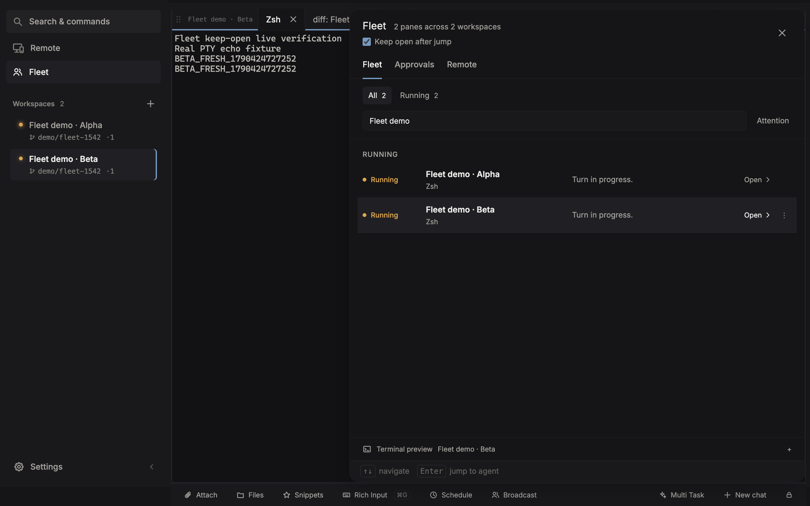
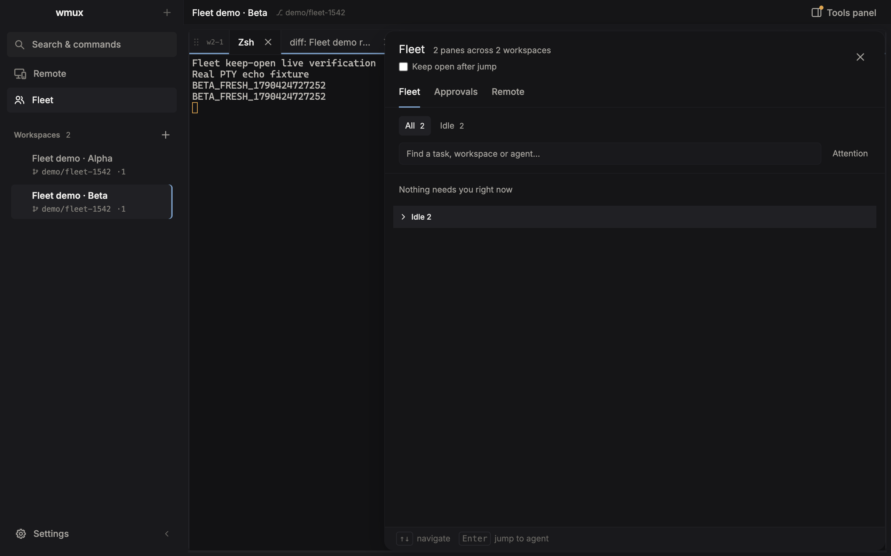

# Live verification for wmux #1542

Source: `bf7b542fce68b80fa6d6702e97e9bccae8fda925` (PR #1548).

macOS, Electron 41 development build, isolated `-fleet1542` profile. The terminal input checks use real daemon-backed PTYs running controlled echo processes. Agent/review/help metadata are demo fixtures; no model inference was invoked. The seeded review test covers navigation and overlay dismissal, not backend diff correctness. The macOS Fleet shortcut is Cmd+Shift+A.

All checks in [report.json](report.json) passed. The restart check stopped and started the full Electron process with the same profile.

## Kept-open navigation and real input

Fleet remains visible with its search after a cross-workspace jump. A unique, newly typed marker reaches the selected PTY even while live status changes reorder rows.

## Full app restart

The same profile reopens with Keep open after jump unchecked.

