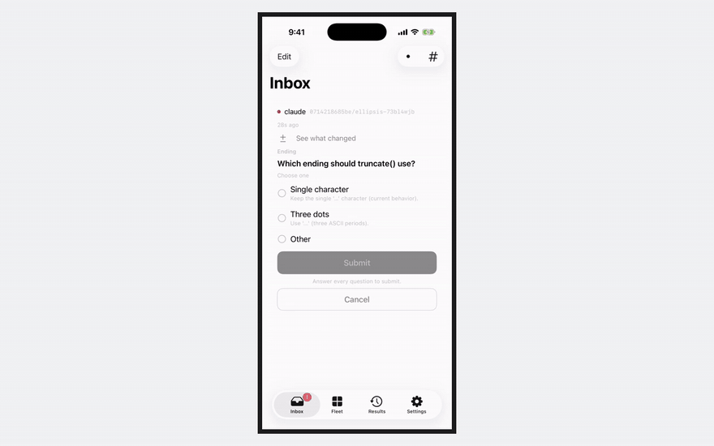
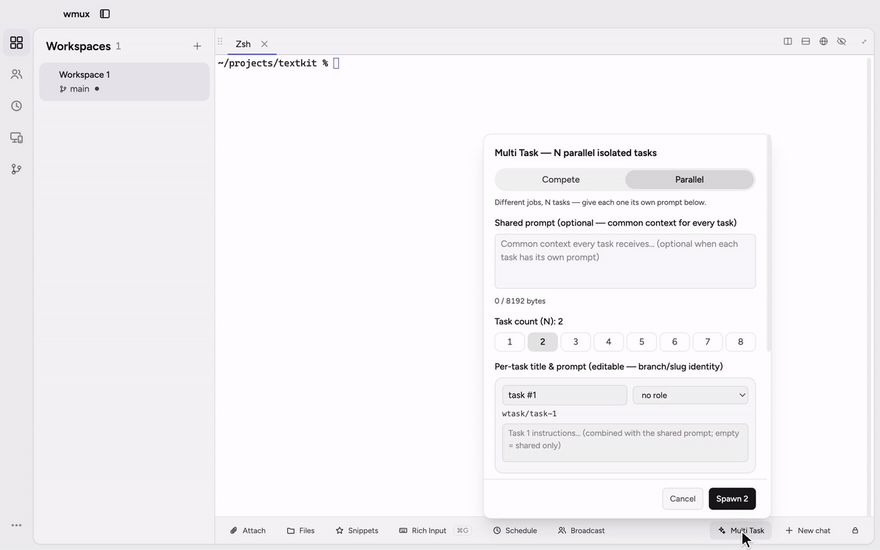
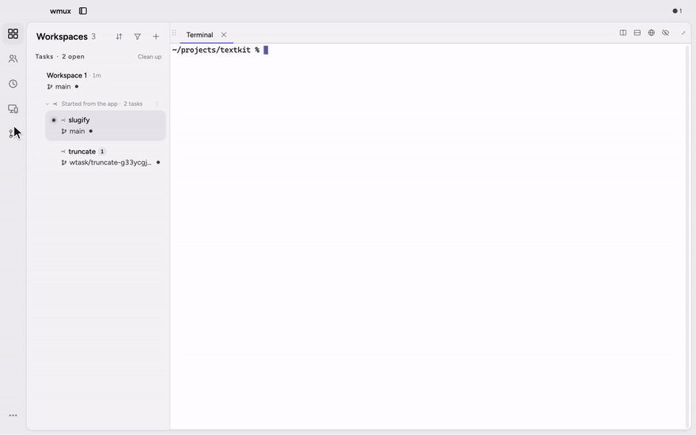
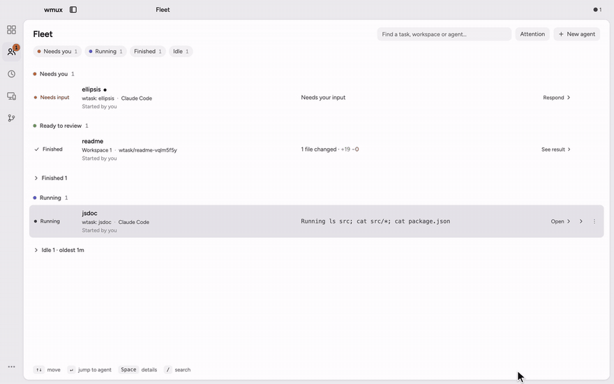
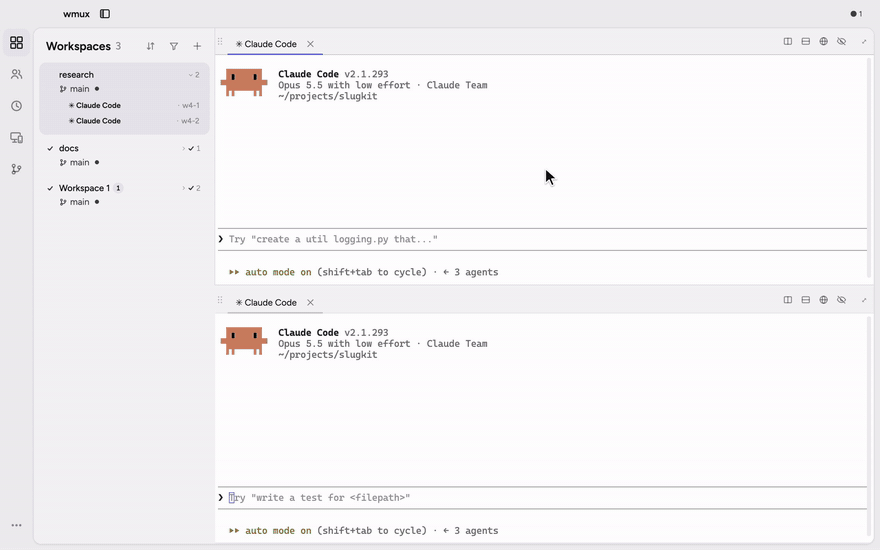
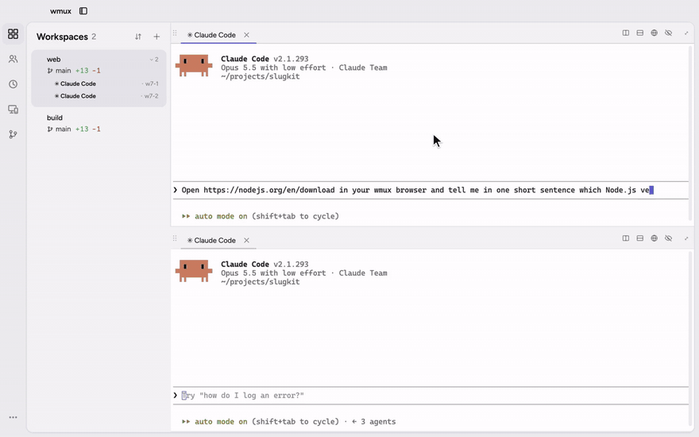
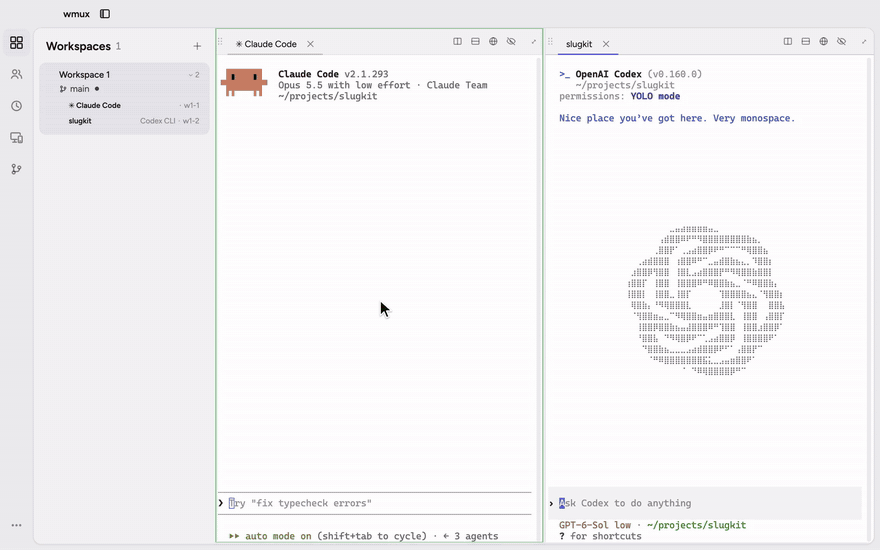
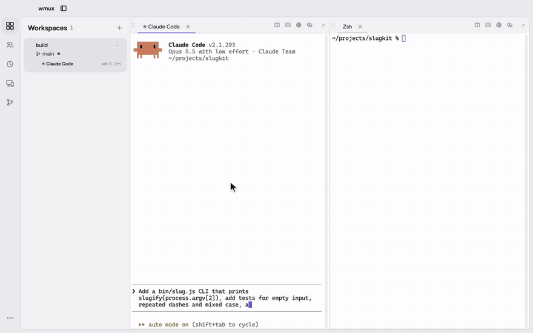
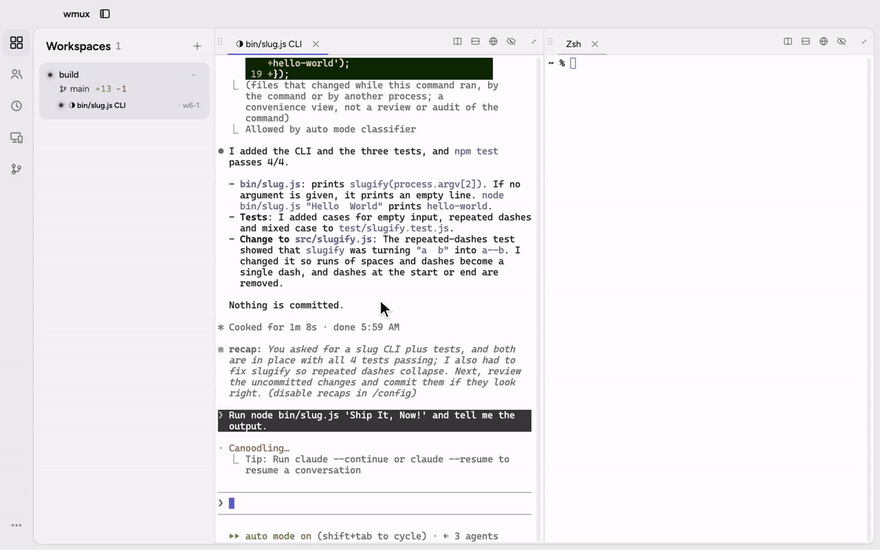
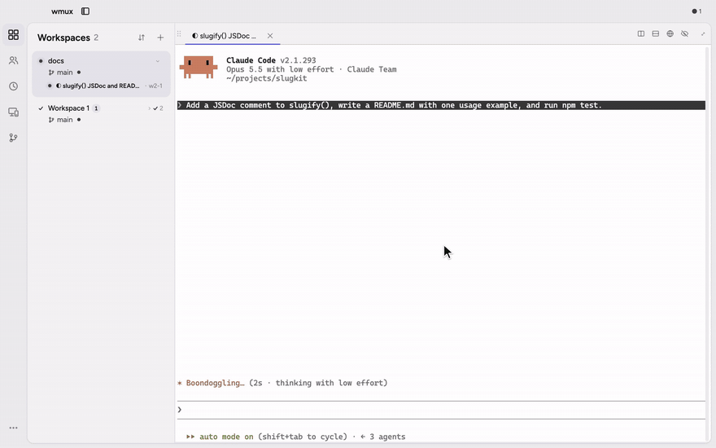

<div align="center">


# wmux

### The ADE for AI agents.

**Automate everything else. Do your true work.**

Run fleets of AI agents — Claude Code, Codex, Gemini, or any CLI — side by side, native on **Windows and macOS**. Let them drive a real browser for the work beyond code, and answer them from your **iPhone**.

[](https://github.com/openwong2kim/wmux/releases/latest)
[](https://github.com/openwong2kim/wmux/releases/latest)
[](https://apps.apple.com/app/wmux-workspace-for-ai-agents/id6797904556)
[](https://github.com/openwong2kim/wmux/releases/latest)
[](https://github.com/openwong2kim/wmux/releases)
[](LICENSE)

[**Download**](https://github.com/openwong2kim/wmux/releases/latest) · [**Website**](https://www.wmux.app) · [**Docs**](docs/README.md) · [**iOS app**](https://apps.apple.com/app/wmux-workspace-for-ai-agents/id6797904556)

<a href="https://www.wmux.app"></a>

<sub>One prompt, three tasks in three git worktrees — the one question that came up answered from a phone, and all three ready to review.</sub>

</div>

wmux is a desktop app where your AI agents work side by side, each in its own pane, while a background daemon on your own machine keeps every session alive. What sets it apart:

- **Any CLI agent, natively on Windows and macOS.** Claude Code, Codex, Gemini, agy (Antigravity), and any other CLI agent run side by side in real PTYs — no WSL needed on Windows.
- **Sessions owned by your own daemon.** Closing the app, a crash, or a reboot does not end your agents' sessions.
- **Answer agents from your iPhone.** The iOS app pairs directly with the daemon on your machine: terminal output and your answers travel between the two without a cloud service in the middle.
- **One prompt, fanned out into git worktrees.** Each task gets its own worktree and agent, and you review the results hunk by hunk.

## Install

**Windows** — a package manager skips the SmartScreen prompt:

```powershell
winget install openwong2kim.wmux    # or: choco install wmux
```

<sub>Offline? [Download Setup.exe](https://github.com/openwong2kim/wmux/releases/latest). It is signed with a SignPath *test* certificate for now, so SmartScreen shows an unknown publisher ([why?](#install-help)).</sub>

**macOS** (Apple Silicon) — [download the .dmg](https://github.com/openwong2kim/wmux/releases/latest) and drag wmux to Applications. It is Developer ID signed and notarized; on first launch the `wmux` CLI installs itself onto your PATH.

**iPhone** — [wmux for iOS on the App Store](https://apps.apple.com/app/wmux-workspace-for-ai-agents/id6797904556) (free). In wmux, open **Remote** on the rail, choose **Share & pair**, turn on HTTPS over Tailscale, and scan the QR code with the app.

**Linux** — experimental AppImage / .deb / .rpm builds are on the [releases page](https://github.com/openwong2kim/wmux/releases/latest).

<sub>Windows x64 and macOS arm64 update themselves: wmux checks for a release every 30 minutes and verifies it against a published SHA-256 before installing.</sub>

## Features

### Answer from your phone

When an agent stops to ask you something — a Claude Code question (single or multi-select, several questions, or an "Other" answer) or a permission prompt — it reaches the Inbox on your iPhone. Answer it there and the pane on your desktop moves on. Terminals and agent output travel straight from the daemon on your machine to your phone. A default install does not send push notifications yet, so you see the question when you open the app. When push is configured, notifications pass through the project's relay as sealed envelopes it cannot read; only the lock-screen Live Activity carries a few counts and your computer's name in plain text. Details: [the phone client contract](docs/phone-client-contract.md).



### One prompt, N worktrees

Fan one prompt out into up to 8 tasks, each in its own git worktree on a fresh `wtask/*` branch with its own agent pane. Review the diffs, tick the hunks you want across files, and adopt them as one all-or-nothing `git apply` — your tree takes the whole selection or stays untouched. Then close the task (the worktree is removed only after a clean check) or open a pull request. See [fan-out task environments](docs/how-to/fan-out-task-environment.md) for ports and prepared worktrees.



### Git page

**Git** on the rail shows a repo's issues and pull requests. A pull request lists its checks, and a failed GitHub Actions run shows the end of its log right there, with **Rerun failed jobs**. Read the diff, comment on a line, approve or request changes, and squash and merge — every action is tied to the commit you were looking at. To hand an issue or PR to an agent, drag its row onto the agent's pane or a workspace in the sidebar; the agent gets a short reference with the link, never the item's text. Signed out? Connect GitHub from the page itself; `gh` keeps the credential.



### Fleet

Fleet (`⌘⇧A` on macOS, `Ctrl+Shift+A` on Windows and Linux) lists every agent across every workspace as one attention list: **Needs you** on top, then Ready to review, Running, and a folded Idle row. A row that needs you shows the agent's question; open it to reply, open the approval, or jump to the pane. Running rows say what the agent is doing (`Running npm test`), and finished rows say what it did last.



### Two ways to browse

Your agents drive a browser through wmux's MCP tools — navigate, click, type, snapshot, screenshot, a stateful `browser_repl`, and `browser_replay` for recorded flows — and you watch every page they touch. Pick the backend in Settings → Browser.

**Built-in browser panes.** A browser pane opens as a split beside the agent, and each agent gets its own.



**A dedicated Chrome over CDP.** Agents drive a real Chrome, each in its own tab, with a persistent profile separate from your daily browser — sign in once and the logins stick. See [browser backends](docs/browser-backends.md) for what CDP can and cannot do.



### Claude Code and Codex, talking

Agents in different panes message each other through wmux, whichever CLI they run. Here Claude Code changes a function and asks the Codex pane next to it for a review with `send_message`; Codex replies the same way with a missing test case, and Claude adds it.



### Survives quit, crash, and reboot

A standalone daemon owns every terminal, so quitting the app leaves your sessions running — processes and all.



After a crash or a reboot, a recovered pane offers **Resume**: it types the agent command back in, with the exact conversation when wmux knows which one the pane held. Panes declared in `wmux.json` with a restart policy are supervised and restarted automatically.



### Usage limits and accounts

When Claude Code or Codex hits its usage limit, the pane pauses: its header and its Fleet row say when the limit resets, and wmux holds scheduled prompts and agent messages for that pane instead of typing them into a turn that cannot run. Turn on **Resume at reset** for a pane (or "Continue after a usage limit resets" in Settings, off by default) and it continues by itself when the window resets. With several of your own Claude or Codex subscriptions registered, **Switch Claude accounts by quota** and **Switch Codex accounts by quota** in Settings → Accounts (both off by default) start a new pane on the account with the most quota left when the workspace's own account is out of quota. Settings → Token usage shows each provider's usage windows.



## More

| Area | What you get |
|------|--------------|
| Agents | **Claude Code** and **Codex CLI** get the full set: status, chat view, approvals from your phone and resume. **OpenCode** and **OpenClaude** report status through their hooks, and so do **Kiro CLI** and **GitHub Copilot CLI** after a one-time setup (`wmux setup-hooks --agent copilot`). **agy**'s status is read from its screen. **Gemini CLI**, **Aider** and **Grok** start from the pickers, but their status detection is not verified yet. Any other CLI runs in a pane too. |
| MCP tools | Browser, terminal, pane, channel, A2A and fan-out tools register themselves; the `full` profile has all of them, the slimmer `core` and `commander` profiles leave out the browser tools — [inventory](docs/api/inventory.md). |
| CLI & API | Script the `wmux` CLI or the token-authenticated socket — [connect to wmux](docs/how-to/connect-to-wmux.md), [react to events](docs/how-to/react-to-events.md). |
| Delegation | Hand work to an agent in another pane and know whether it arrived — [delegate to agents](docs/how-to/delegate-to-agents.md). |
| Schedules | Queue an exact prompt for one agent session; it waits until the session is idle — [prompt schedules](docs/how-to/session-prompt-scheduling.md). |
| Remote | `wmux web` serves your panes to a browser, read-only and loopback-only by default; attach another machine's workspaces — [remote workspaces](docs/how-to/remote-workspaces.md). |
| Browser flows | Record a web flow once and replay it — [replay browser flows](docs/how-to/replay-browser-flows.md). |
| Workspaces | Per-workspace environment and startup command, e.g. for separate accounts — [workspace profiles](docs/workspace-profiles.md). |
| Recovery | Daemon restarts and WSL sessions — [daemon restart](docs/how-to/handle-daemon-restart.md), [WSL recovery](docs/how-to/wsl-session-recovery.md). |
| Performance | What runs while a pane is hidden, and `wmux doctor` — [performance](docs/performance.md). |
| Look & language | Light and dark UI themes, terminal palettes, 23 locales — [translations welcome](https://github.com/openwong2kim/wmux/labels/good%20first%20issue). |
| Security | Token-authenticated IPC, PTY input sanitization, approval gates for cross-agent execution — [security](docs/SECURITY.md). |

<details>
<summary><b>Keyboard shortcuts</b></summary>

| Key | Action | Key | Action |
|-----|--------|-----|--------|
| `Ctrl+D` | Split right | `Ctrl+Shift+D` | Split down |
| `Ctrl+T` / `Ctrl+W` | New / close tab | `Ctrl+N` | New workspace |
| `Ctrl+1~8` | Switch workspace | `Ctrl+9` | Last workspace |
| `Ctrl+Shift+A` | Fleet | `Ctrl+Shift+L` | Open browser |
| `Ctrl+K` | Command palette | `Ctrl+,` | Settings |
| `Ctrl+F` | Search | `Ctrl+I` | Notifications |
| `Ctrl+Shift+X` | Vi copy mode | `` Ctrl+` `` | Floating pane |
| `Ctrl+B` → key | Prefix mode | `Ctrl+Shift+B` | Toggle sidebar |

<sub>On **macOS**, app shortcuts use `⌘` instead of `Ctrl` (a few bindings, such as prefix mode, `Ctrl+Shift+B` and `Ctrl+M`, keep literal `Ctrl`), so `Ctrl+C`, `Ctrl+D` and friends pass through to the shell. Every shortcut can be changed in Settings.</sub>

</details>

<a id="install-help"></a>

<details>
<summary><b>FAQ + install troubleshooting</b></summary>

- **Is wmux a tmux port?** No — tmux was the inspiration, not the base. wmux is a native app on Electron (ConPTY on Windows, forkpty on macOS) with tmux-style split panes, prefix keys and session persistence, plus agents, git worktrees and a browser. No WSL / Cygwin / MSYS2.
- **Which Macs are supported?** Apple Silicon (arm64). The `.dmg` is Developer ID signed, notarized and stapled. Intel builds aren't produced right now; open an issue if you need one.
- **Can I reach my panes without the iPhone app?** Yes: `wmux web` serves your live panes to any browser. It is read-only and loopback-only by default; input and network exposure are explicit opt-ins. Even read-only shows a pane's full scrollback to whoever can reach the port, so do not publish it to the open internet. See [remote workspaces](docs/how-to/remote-workspaces.md) and [the phone client contract](docs/phone-client-contract.md).
- **Feels heavy, or a workspace switch is slow?** See [docs/performance.md](docs/performance.md).
- **"Windows protected your PC" warning?** The release pipeline signs `Setup.exe` through [SignPath](https://signpath.io/), but with a *test* certificate while the [SignPath Foundation](https://signpath.org/) OSS certificate is pending — Windows does not trust it, so SmartScreen still reports an unknown publisher. Click **More info → Run anyway**, or install via **winget** / **Chocolatey** to skip the prompt.
- **Installing or updating by hand with Setup.exe?** First shut wmux down completely: right-click the tray icon → **Shut down wmux (close all sessions)**. Plain *Quit* keeps the session daemon running, and Setup.exe cannot replace a running wmux: it fails with "Failed to remove existing directory". If that already happened, wait a few seconds for wmux to exit, then run Setup.exe again. The in-app updater handles all of this for you.
- **Installer blocked with no "Run anyway"?** **Smart App Control (SAC)** on Windows 11 can block unsigned binaries outright. Check with `Get-MpComputerStatus | Select-Object SmartAppControlState`. SAC uses cloud reputation, so blocks are often transient — retry later, use winget/choco, or build from source ([#200](https://github.com/openwong2kim/wmux/issues/200)).

**PowerShell one-liner** (downloads the prebuilt Setup.exe, verifies SHA-256, no build tools):
```powershell
irm https://raw.githubusercontent.com/openwong2kim/wmux/main/install.ps1 | iex
```

</details>

## Build from source

```powershell
git clone https://github.com/openwong2kim/wmux.git
cd wmux
npm install
npm start          # dev mode
npm run make       # build installer
```

Requires Node 18+ and Python 3.x, plus a native toolchain: VS Build Tools (C++ workload) on Windows — `WMUX_FROM_SOURCE=1 irm …/install.ps1 | iex` auto-installs them — or the Xcode Command Line Tools on macOS (`xcode-select --install`).

## Contributors

wmux is built in the open. Thanks to everyone who has shipped code, squashed bugs, and translated locales:

[](https://github.com/openwong2kim/wmux/graphs/contributors)

Community shout-outs to [@snowyukitty](https://github.com/snowyukitty), [@matdac6](https://github.com/matdac6), [@margvez](https://github.com/margvez), [@zer0ken](https://github.com/zer0ken), [@AnandSundar](https://github.com/AnandSundar), [@cloim](https://github.com/cloim), [@cheyras](https://github.com/cheyras), [@junbeom09](https://github.com/junbeom09), [@rayss868](https://github.com/rayss868), [@dev-minggyu](https://github.com/dev-minggyu), and [@alphabeen](https://github.com/alphabeen).

**New here?** Grab a [good first issue](https://github.com/openwong2kim/wmux/labels/good%20first%20issue), help translate a locale, or read [CONTRIBUTING.md](CONTRIBUTING.md). PRs welcome. Built on [xterm.js](https://xtermjs.org/), [node-pty](https://github.com/microsoft/node-pty), [Electron](https://www.electronjs.org/), and [Playwright](https://playwright.dev/).

> wmux runs the agent CLIs you install and sign in to yourself. You are responsible for complying with your AI provider's Terms of Service.

## License

[MIT](LICENSE)

<sub>**Keywords:** ADE · agent development environment · AI agent automation · workspace multiplexer · AI coding agent workspace · agent fleet · multi-agent terminal · git worktree fan-out · Claude Code · Codex CLI · Gemini CLI · iOS approval app · MCP server · Chrome DevTools Protocol · browser automation · split terminal · Windows terminal multiplexer · macOS terminal multiplexer · ConPTY · xterm.js · Electron terminal · tmux for Windows</sub>

<div align="center"><sub>⭐ Star history</sub><br>

[](https://star-history.com/#openwong2kim/wmux&Date)

</div>
